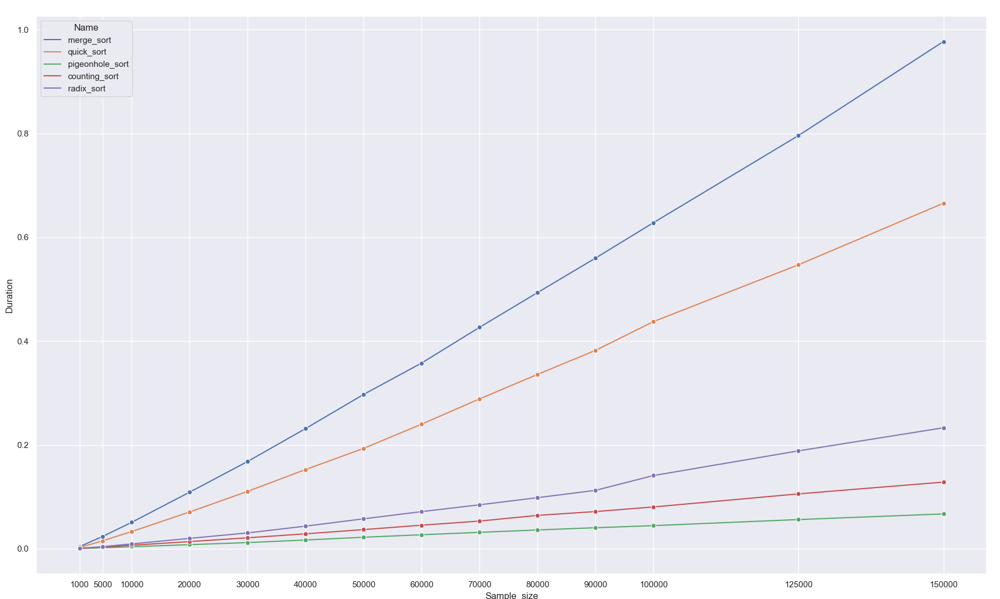
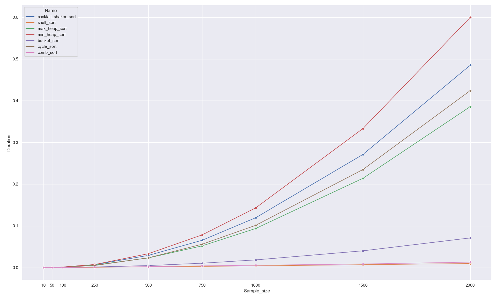

# 3. feladat, benchmarking

Az alapvető ötletünk az volt, hogy egyes rendező algoritmusok futási idejét valahogy megmérjük és ennek vizualizációjával
vizsgáljuk hogy a leimplementált algoritmusok teljesítik-e a várt komplexitásukat.

Ennek a mérésére a python **timeit** funkcióját használtuk, az adatokat pedig a **pandas, matplotlib** és **seaborn** 
könyvtárak segítségével tároltuk és vizualizáltuk.

2 csoportra bontottuk a kiválasztott algoritmusokat.

**1.csoport:**
- Merge sort
- Quick sort
- Pigeonhole sort
- Counting sort
- Radix sort

**2.csoport:**
- Cocktail Shaker sort
- Shell sort
- Max Heap sort
- Min Heap sort
- Bucket sort
- Cycle sort
- Comb sort

A két csoport között a különbség csak a rendezendő számok mennyiségében volt, mivel az 1-es csoportba tartozó
rendezési algoritmusok viszonylag gyorsan tudnak rendezni több tízeres méretű tömböket, ellenben a 2-es csoportban megtalálhatóak
olyan algoritmusok amik tízezres nagyságrendben egyes esetekben órákig is rendeznék a random számokkal feltöltött tömböket. 

# Eredmények

**1.Csoport**  

| Name       | Worst-case           | Avg  | Best-case|
| ------------- |:-------------:| -----:|-----:|
| Merge sort    | O(n*log(n))| O(n*log(n))|O(n*log(n))    |
| Quick sort     | O(n^2)      |   O(n*log(n))  |O(n*log(n))   |
| Pigeonhole sort | O(N+n)     |    O(N+n) |O(N+n)  |
| Counting sort |    O(n+k)   |    O(n+k) |O(n+k) |
| Radix sort | O(n*k)     |    O(n*k)  |   O(n*k)       |

A Diagrammokon látható, hogy többnyire kijönnek a várt eredmények és a különbségek a futási komplexitások között.
Az egyetlen érdekesebb eredmény a Merge sort-nál vehető észre ami sokkal rosszabban teljesít mint a quick sort, ami nem
lenne elvárt, ezért érdemes lehet felülvizsgálni a Merge sort implementációját.

**2.csoport**

| Name       | Worst-case           | Avg  | Best-case|
| ------------- |:-------------:| -----:|-----:|
| Cocktail Shaker sort    | O(n^2)| O(n^2)|O(n)    |
| Shell sort    | O(n^2)      |   O(n*log(n))  |O(n*log(n))   |
| Max Heap sort | O(n*log(n)) |   O(n*log(n)) |O(n*log(n))  |
| Min Heap sort |  O(n*log(n))|   O(n*log(n)) |O(n*log(n)) |
| Bucket sort | O(n^2)      |    O(n)  |   O(n+k)       |
| Cycle sort |   O(n^2)   |    O(n^2) |O(n^2) |
| Comb sort | O(n^2)     |    O(n*log(n))  |   O( (n^2)/(k^p) )  |

Itt is többnyire láthatóak a várt eredmények, és a mért komplexitások közötti különbségek. Ami érdekes, hogy a heap rendezések
a várt komplexitáshoz képest rosszabbul teljesítenek, ezért ezek implementációját is érdemes lehet felülvizsgálni.
